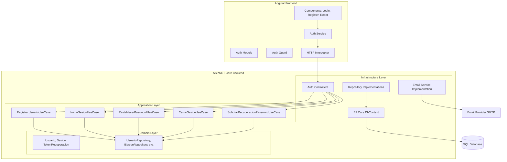
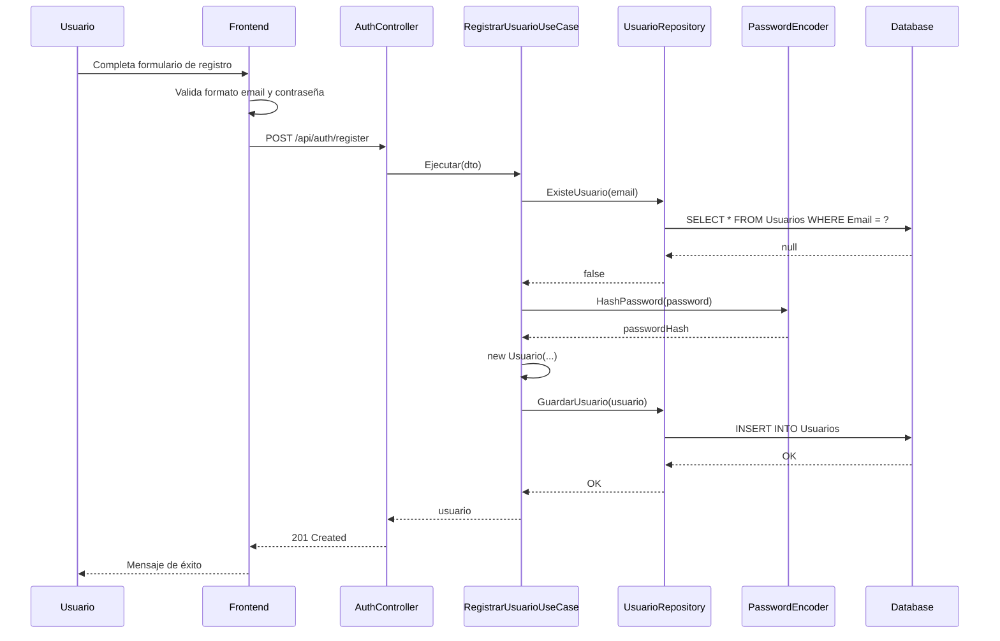
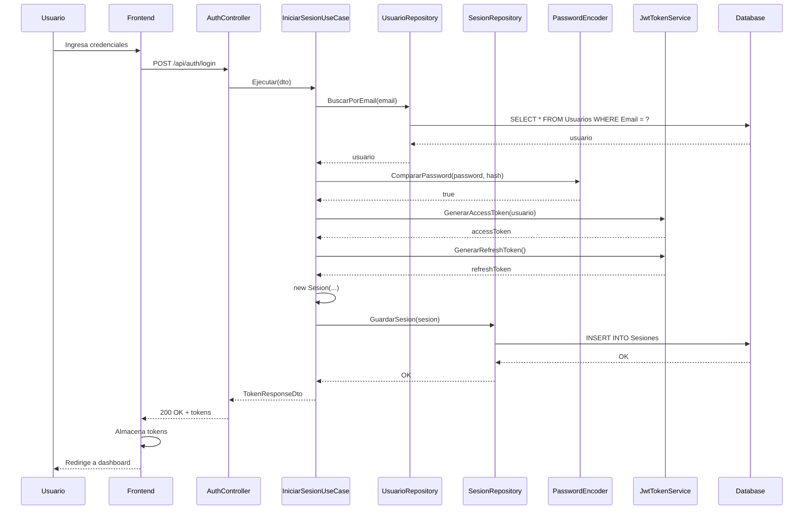
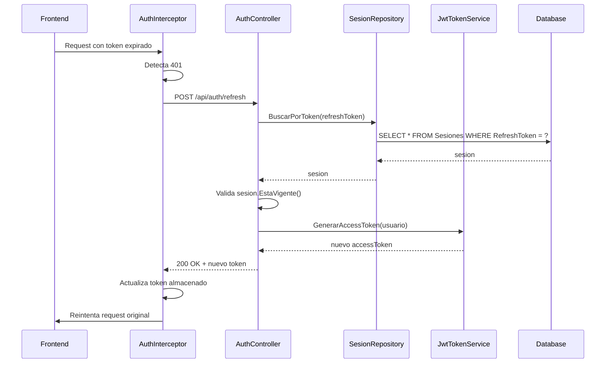
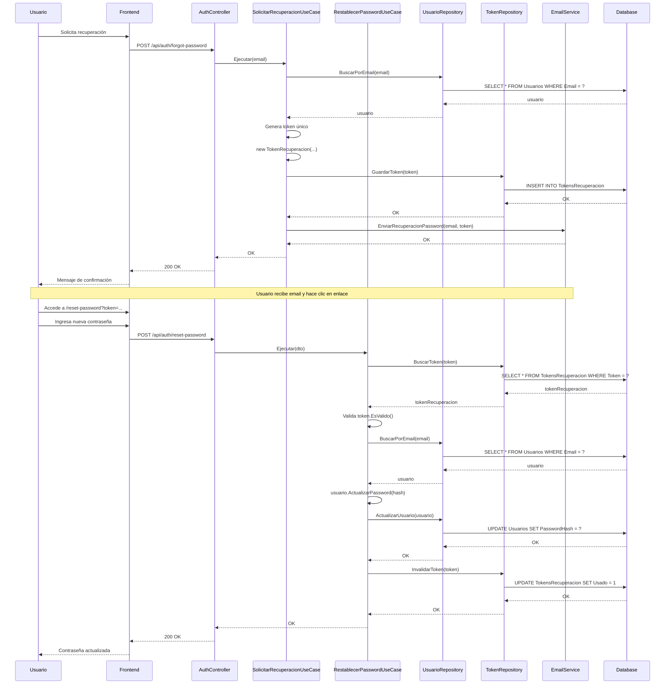

# Documento de Diseño Técnico - Sistema de Autenticación

## Overview

Este documento describe el diseño técnico del sistema de autenticación que incluye un backend en C#/.NET y un frontend en Angular. El sistema implementa Clean Architecture para garantizar separación de responsabilidades, mantenibilidad y testabilidad.

### Objetivos del Sistema

- Proporcionar autenticación segura mediante JWT (Access Token y Refresh Token)
- Implementar registro de usuarios con validación robusta
- Gestionar sesiones de usuario con renovación automática de tokens
- Permitir recuperación de contraseñas mediante tokens temporales
- Ofrecer una interfaz de usuario intuitiva y responsiva en Angular
- Seguir mejores prácticas de seguridad (rate limiting, HTTPS, headers de seguridad)

### Tecnologías Principales

**Backend:**
- C# / .NET 8.0
- ASP.NET Core Web API
- Entity Framework Core (para persistencia)
- JWT Bearer Authentication
- BCrypt.Net (para hashing de contraseñas)
- FluentValidation (para validación de datos)

**Frontend:**
- Angular 17+
- RxJS (para gestión de estado reactivo)
- Angular HTTP Interceptors (para gestión automática de tokens)
- Angular Reactive Forms (para formularios)


## Architecture

El sistema sigue los principios de Clean Architecture, organizando el código en capas concéntricas donde las dependencias apuntan hacia el centro (Domain/Core).

### Capas de Clean Architecture

```
┌─────────────────────────────────────────────────────────┐
│                    Infrastructure                        │
│  (Controllers, Repositories, Email Service, DB Context)  │
│                                                           │
│  ┌───────────────────────────────────────────────────┐  │
│  │              Application (UseCases)                │  │
│  │  (RegistrarUsuario, IniciarSesion, etc.)          │  │
│  │                                                     │  │
│  │  ┌─────────────────────────────────────────────┐  │  │
│  │  │           Domain (Core)                     │  │  │
│  │  │  (Entities, Interfaces, Domain Logic)       │  │  │
│  │  └─────────────────────────────────────────────┘  │  │
│  └───────────────────────────────────────────────────┘  │
└─────────────────────────────────────────────────────────┘
```

**1. Domain/Core Layer (Capa más interna)**
- Contiene entidades de dominio (Usuario, Sesion, TokenRecuperacion)
- Define interfaces de repositorios y servicios
- No tiene dependencias externas
- Contiene la lógica de negocio pura

**2. Application/UseCases Layer**
- Implementa los casos de uso del sistema
- Orquesta el flujo de datos entre capas
- Depende solo de la capa Domain
- Contiene la lógica de aplicación

**3. Infrastructure Layer (Capa más externa)**
- Implementa las interfaces definidas en Domain
- Contiene controladores API, repositorios concretos, servicios externos
- Maneja detalles de implementación (base de datos, email, etc.)
- Depende de Application y Domain

### Diagrama de Componentes




## Components and Interfaces

### Backend - Estructura de Carpetas

```
AuthBackend/
├── src/
│   ├── AuthBackend.Domain/              # Core Layer
│   │   ├── Entities/
│   │   │   ├── Usuario.cs
│   │   │   ├── Sesion.cs
│   │   │   └── TokenRecuperacion.cs
│   │   ├── Interfaces/
│   │   │   ├── IUsuarioRepository.cs
│   │   │   ├── ISesionRepository.cs
│   │   │   ├── ITokenRepository.cs
│   │   │   ├── IPasswordEncoder.cs
│   │   │   └── IEmailService.cs
│   │   └── Exceptions/
│   │       ├── UsuarioYaExisteException.cs
│   │       ├── CredencialesInvalidasException.cs
│   │       ├── TokenInvalidoException.cs
│   │       └── UsuarioInactivoException.cs
│   │
│   ├── AuthBackend.Application/         # UseCases Layer
│   │   ├── UseCases/
│   │   │   ├── RegistrarUsuarioUseCase.cs
│   │   │   ├── IniciarSesionUseCase.cs
│   │   │   ├── RestablecerPasswordUseCase.cs
│   │   │   ├── CerrarSesionUseCase.cs
│   │   │   └── SolicitarRecuperacionPasswordUseCase.cs
│   │   ├── DTOs/
│   │   │   ├── RegistroUsuarioDto.cs
│   │   │   ├── LoginDto.cs
│   │   │   ├── TokenResponseDto.cs
│   │   │   ├── RecuperacionPasswordDto.cs
│   │   │   └── RestablecerPasswordDto.cs
│   │   └── Validators/
│   │       ├── RegistroUsuarioValidator.cs
│   │       └── PasswordValidator.cs
│   │
│   └── AuthBackend.Infrastructure/      # Infrastructure Layer
│       ├── Controllers/
│       │   └── AuthController.cs
│       ├── Persistence/
│       │   ├── AuthDbContext.cs
│       │   ├── Repositories/
│       │   │   ├── UsuarioRepository.cs
│       │   │   ├── SesionRepository.cs
│       │   │   └── TokenRepository.cs
│       │   └── Configurations/
│       │       ├── UsuarioConfiguration.cs
│       │       ├── SesionConfiguration.cs
│       │       ├── TokenRecuperacionConfiguration.cs
│       │       └── EstadoUsuarioConfiguration.cs
│       ├── Services/
│       │   ├── PasswordEncoder.cs
│       │   ├── EmailService.cs
│       │   └── JwtTokenService.cs
│       ├── Middleware/
│       │   ├── RateLimitingMiddleware.cs
│       │   └── ExceptionHandlingMiddleware.cs
│       └── Program.cs
│
└── tests/
    ├── AuthBackend.Domain.Tests/
    ├── AuthBackend.Application.Tests/
    └── AuthBackend.Infrastructure.Tests/
```

### Domain Layer - Entidades

#### Usuario.cs
```csharp
public class Usuario
{
    public Guid Id { get; private set; }
    public string Nombres { get; private set; }
    public string Apellidos { get; private set; }
    public string Cedula { get; private set; }
    public string Email { get; private set; }
    public string PasswordHash { get; private set; }
    public int EstadoId { get; private set; }
    public EstadoUsuario Estado { get; private set; } // Navegación EF Core
    public DateTime FechaCreacion { get; private set; }
    public DateTime? FechaActualizacion { get; private set; }

    private Usuario() { } // Para EF Core

    public Usuario(string nombres, string apellidos, string cedula, string email, string passwordHash, int estadoId = EstadosUsuario.Activo)
    {
        Id = Guid.NewGuid();
        Nombres = nombres;
        Apellidos = apellidos;
        Cedula = cedula;
        Email = email.ToLowerInvariant();
        PasswordHash = passwordHash;
        EstadoId = estadoId;
        FechaCreacion = DateTime.UtcNow;
    }

    public void ActualizarPassword(string nuevoPasswordHash)
    {
        PasswordHash = nuevoPasswordHash;
        FechaActualizacion = DateTime.UtcNow;
    }

    public bool EstaActivo() => EstadoId == EstadosUsuario.Activo;
}
```

#### EstadoUsuario.cs
```csharp
public class EstadoUsuario
{
    public int Id { get; private set; }
    public string Nombre { get; private set; }
    public string Descripcion { get; private set; }

    private EstadoUsuario() { } // Para EF Core
}

// Constantes para evitar magic numbers en el dominio
public static class EstadosUsuario
{
    public const int Activo = 1;
    public const int Inactivo = 2;
    public const int Suspendido = 3;
}
```

#### Sesion.cs
```csharp
public class Sesion
{
    public Guid Id { get; private set; }
    public Guid UsuarioId { get; private set; }
    public string RefreshToken { get; private set; }
    public DateTime FechaCreacion { get; private set; }
    public DateTime FechaExpiracion { get; private set; }
    public bool Revocado { get; private set; }
    public DateTime? FechaRevocacion { get; private set; }

    private Sesion() { } // Para EF Core

    public Sesion(Guid usuarioId, string refreshToken, DateTime fechaExpiracion)
    {
        Id = Guid.NewGuid();
        UsuarioId = usuarioId;
        RefreshToken = refreshToken;
        FechaCreacion = DateTime.UtcNow;
        FechaExpiracion = fechaExpiracion;
        Revocado = false;
    }

    public void Revocar()
    {
        Revocado = true;
        FechaRevocacion = DateTime.UtcNow;
    }

    public bool EstaVigente()
    {
        return !Revocado && DateTime.UtcNow < FechaExpiracion;
    }
}
```

#### TokenRecuperacion.cs
```csharp
public class TokenRecuperacion
{
    public Guid Id { get; private set; }
    public Guid UsuarioId { get; private set; }
    public string Token { get; private set; }
    public DateTime FechaCreacion { get; private set; }
    public DateTime FechaExpiracion { get; private set; }
    public bool Usado { get; private set; }
    public DateTime? FechaUso { get; private set; }

    private TokenRecuperacion() { } // Para EF Core

    public TokenRecuperacion(Guid usuarioId, string token)
    {
        Id = Guid.NewGuid();
        UsuarioId = usuarioId;
        Token = token;
        FechaCreacion = DateTime.UtcNow;
        FechaExpiracion = DateTime.UtcNow.AddHours(1);
        Usado = false;
    }

    public void MarcarComoUsado()
    {
        Usado = true;
        FechaUso = DateTime.UtcNow;
    }

    public bool EsValido()
    {
        return !Usado && DateTime.UtcNow < FechaExpiracion;
    }
}
```


### Domain Layer - Interfaces

#### IUsuarioRepository.cs
```csharp
public interface IUsuarioRepository
{
    Task<Usuario?> BuscarPorEmail(string email);
    Task<bool> ExisteUsuario(string email);
    Task GuardarUsuario(Usuario usuario);
    Task ActualizarUsuario(Usuario usuario);
}
```

#### ISesionRepository.cs
```csharp
public interface ISesionRepository
{
    Task GuardarSesion(Sesion sesion);
    Task<Sesion?> BuscarPorToken(string token);
    Task FinalizarSesion(string token);
    Task RevocarTodasLasSesionesDelUsuario(Guid usuarioId);
}
```

#### ITokenRepository.cs
```csharp
public interface ITokenRepository
{
    Task GuardarToken(TokenRecuperacion token);
    Task<TokenRecuperacion?> BuscarToken(string token);
    Task InvalidarToken(string token);
}
```

#### IPasswordEncoder.cs
```csharp
public interface IPasswordEncoder
{
    string HashPassword(string password);
    bool CompararPassword(string password, string hash);
}
```

#### IEmailService.cs
```csharp
public interface IEmailService
{
    Task EnviarRecuperacionPassword(string email, string token);
}
```

### Application Layer - Use Cases

#### RegistrarUsuarioUseCase.cs
```csharp
public class RegistrarUsuarioUseCase
{
    private readonly IUsuarioRepository _usuarioRepository;
    private readonly IPasswordEncoder _passwordEncoder;

    public RegistrarUsuarioUseCase(
        IUsuarioRepository usuarioRepository,
        IPasswordEncoder passwordEncoder)
    {
        _usuarioRepository = usuarioRepository;
        _passwordEncoder = passwordEncoder;
    }

    public async Task<Usuario> Ejecutar(RegistroUsuarioDto dto)
    {
        // Validar que el usuario no exista
        if (await _usuarioRepository.ExisteUsuario(dto.Email))
        {
            throw new UsuarioYaExisteException($"El email {dto.Email} ya está registrado");
        }

        // Validar formato de email y contraseña (usando FluentValidation)
        // Hash de la contraseña
        var passwordHash = _passwordEncoder.HashPassword(dto.Password);

        // Crear entidad Usuario con estado Activo por defecto
        var usuario = new Usuario(
            dto.Nombres,
            dto.Apellidos,
            dto.Cedula,
            dto.Email,
            passwordHash,
            EstadosUsuario.Activo
        );

        // Guardar en repositorio
        await _usuarioRepository.GuardarUsuario(usuario);

        return usuario;
    }
}
```

#### IniciarSesionUseCase.cs
```csharp
public class IniciarSesionUseCase
{
    private readonly IUsuarioRepository _usuarioRepository;
    private readonly ISesionRepository _sesionRepository;
    private readonly IPasswordEncoder _passwordEncoder;
    private readonly JwtTokenService _jwtTokenService;

    public IniciarSesionUseCase(
        IUsuarioRepository usuarioRepository,
        ISesionRepository sesionRepository,
        IPasswordEncoder passwordEncoder,
        JwtTokenService jwtTokenService)
    {
        _usuarioRepository = usuarioRepository;
        _sesionRepository = sesionRepository;
        _passwordEncoder = passwordEncoder;
        _jwtTokenService = jwtTokenService;
    }

    public async Task<TokenResponseDto> Ejecutar(LoginDto dto)
    {
        // Buscar usuario por email
        var usuario = await _usuarioRepository.BuscarPorEmail(dto.Email);
        
        // Validar credenciales
        if (usuario == null || !_passwordEncoder.CompararPassword(dto.Password, usuario.PasswordHash))
        {
            throw new CredencialesInvalidasException("Credenciales inválidas");
        }

        // Verificar que el usuario esté activo
        if (!usuario.EstaActivo())
        {
            throw new UsuarioInactivoException("La cuenta de usuario no está activa");
        }

        // Generar tokens
        var accessToken = _jwtTokenService.GenerarAccessToken(usuario);
        var refreshToken = _jwtTokenService.GenerarRefreshToken();

        // Crear y guardar sesión
        var sesion = new Sesion(
            usuario.Id,
            refreshToken,
            DateTime.UtcNow.AddDays(7)
        );
        await _sesionRepository.GuardarSesion(sesion);

        return new TokenResponseDto
        {
            AccessToken = accessToken,
            RefreshToken = refreshToken,
            ExpiresIn = 900 // 15 minutos en segundos
        };
    }
}
```

#### RestablecerPasswordUseCase.cs
```csharp
public class RestablecerPasswordUseCase
{
    private readonly IUsuarioRepository _usuarioRepository;
    private readonly ITokenRepository _tokenRepository;
    private readonly ISesionRepository _sesionRepository;
    private readonly IPasswordEncoder _passwordEncoder;

    public RestablecerPasswordUseCase(
        IUsuarioRepository usuarioRepository,
        ITokenRepository tokenRepository,
        ISesionRepository sesionRepository,
        IPasswordEncoder passwordEncoder)
    {
        _usuarioRepository = usuarioRepository;
        _tokenRepository = tokenRepository;
        _sesionRepository = sesionRepository;
        _passwordEncoder = passwordEncoder;
    }

    public async Task Ejecutar(RestablecerPasswordDto dto)
    {
        // Buscar token de recuperación
        var tokenRecuperacion = await _tokenRepository.BuscarToken(dto.Token);
        
        if (tokenRecuperacion == null || !tokenRecuperacion.EsValido())
        {
            throw new TokenInvalidoException("Token de recuperación inválido o expirado");
        }

        // Buscar usuario
        var usuario = await _usuarioRepository.BuscarPorEmail(dto.Email);
        if (usuario == null || usuario.Id != tokenRecuperacion.UsuarioId)
        {
            throw new TokenInvalidoException("Token no corresponde al usuario");
        }

        // Actualizar contraseña
        var nuevoPasswordHash = _passwordEncoder.HashPassword(dto.NuevaPassword);
        usuario.ActualizarPassword(nuevoPasswordHash);
        await _usuarioRepository.ActualizarUsuario(usuario);

        // Marcar token como usado
        tokenRecuperacion.MarcarComoUsado();
        await _tokenRepository.InvalidarToken(dto.Token);

        // Revocar todas las sesiones del usuario
        await _sesionRepository.RevocarTodasLasSesionesDelUsuario(usuario.Id);
    }
}
```

#### CerrarSesionUseCase.cs
```csharp
public class CerrarSesionUseCase
{
    private readonly ISesionRepository _sesionRepository;

    public CerrarSesionUseCase(ISesionRepository sesionRepository)
    {
        _sesionRepository = sesionRepository;
    }

    public async Task Ejecutar(string refreshToken)
    {
        await _sesionRepository.FinalizarSesion(refreshToken);
    }
}
```

#### SolicitarRecuperacionPasswordUseCase.cs
```csharp
public class SolicitarRecuperacionPasswordUseCase
{
    private readonly IUsuarioRepository _usuarioRepository;
    private readonly ITokenRepository _tokenRepository;
    private readonly IEmailService _emailService;

    public SolicitarRecuperacionPasswordUseCase(
        IUsuarioRepository usuarioRepository,
        ITokenRepository tokenRepository,
        IEmailService emailService)
    {
        _usuarioRepository = usuarioRepository;
        _tokenRepository = tokenRepository;
        _emailService = emailService;
    }

    public async Task Ejecutar(RecuperacionPasswordDto dto)
    {
        // Buscar usuario (sin revelar si existe o no)
        var usuario = await _usuarioRepository.BuscarPorEmail(dto.Email);
        
        if (usuario != null)
        {
            // Generar token de recuperación
            var token = Guid.NewGuid().ToString("N");
            var tokenRecuperacion = new TokenRecuperacion(usuario.Id, token);
            
            await _tokenRepository.GuardarToken(tokenRecuperacion);
            
            // Enviar email
            await _emailService.EnviarRecuperacionPassword(dto.Email, token);
        }
        
        // Siempre retornar éxito para no revelar si el email existe
    }
}
```


### Infrastructure Layer - Controllers

#### AuthController.cs
```csharp
[ApiController]
[Route("api/[controller]")]
public class AuthController : ControllerBase
{
    private readonly RegistrarUsuarioUseCase _registrarUsuarioUseCase;
    private readonly IniciarSesionUseCase _iniciarSesionUseCase;
    private readonly RestablecerPasswordUseCase _restablecerPasswordUseCase;
    private readonly CerrarSesionUseCase _cerrarSesionUseCase;
    private readonly SolicitarRecuperacionPasswordUseCase _solicitarRecuperacionUseCase;

    [HttpPost("register")]
    [ProducesResponseType(typeof(UsuarioResponseDto), StatusCodes.Status201Created)]
    [ProducesResponseType(StatusCodes.Status400BadRequest)]
    public async Task<IActionResult> Register([FromBody] RegistroUsuarioDto dto)
    {
        var usuario = await _registrarUsuarioUseCase.Ejecutar(dto);
        return CreatedAtAction(nameof(Register), new UsuarioResponseDto(usuario));
    }

    [HttpPost("login")]
    [ProducesResponseType(typeof(TokenResponseDto), StatusCodes.Status200OK)]
    [ProducesResponseType(StatusCodes.Status401Unauthorized)]
    public async Task<IActionResult> Login([FromBody] LoginDto dto)
    {
        var tokens = await _iniciarSesionUseCase.Ejecutar(dto);
        return Ok(tokens);
    }

    [HttpPost("refresh")]
    [ProducesResponseType(typeof(TokenResponseDto), StatusCodes.Status200OK)]
    [ProducesResponseType(StatusCodes.Status401Unauthorized)]
    public async Task<IActionResult> RefreshToken([FromBody] RefreshTokenDto dto)
    {
        // Implementación de renovación de token
        return Ok();
    }

    [HttpPost("logout")]
    [Authorize]
    [ProducesResponseType(StatusCodes.Status200OK)]
    public async Task<IActionResult> Logout([FromBody] LogoutDto dto)
    {
        await _cerrarSesionUseCase.Ejecutar(dto.RefreshToken);
        return Ok(new { message = "Sesión cerrada exitosamente" });
    }

    [HttpPost("forgot-password")]
    [ProducesResponseType(StatusCodes.Status200OK)]
    public async Task<IActionResult> ForgotPassword([FromBody] RecuperacionPasswordDto dto)
    {
        await _solicitarRecuperacionUseCase.Ejecutar(dto);
        return Ok(new { message = "Si el email existe, recibirás instrucciones de recuperación" });
    }

    [HttpPost("reset-password")]
    [ProducesResponseType(StatusCodes.Status200OK)]
    [ProducesResponseType(StatusCodes.Status400BadRequest)]
    public async Task<IActionResult> ResetPassword([FromBody] RestablecerPasswordDto dto)
    {
        await _restablecerPasswordUseCase.Ejecutar(dto);
        return Ok(new { message = "Contraseña actualizada exitosamente" });
    }
}
```

### Infrastructure Layer - Services

#### JwtTokenService.cs
```csharp
public class JwtTokenService
{
    private readonly IConfiguration _configuration;

    public JwtTokenService(IConfiguration configuration)
    {
        _configuration = configuration;
    }

    public string GenerarAccessToken(Usuario usuario)
    {
        var claims = new[]
        {
            new Claim(JwtRegisteredClaimNames.Sub, usuario.Id.ToString()),
            new Claim(JwtRegisteredClaimNames.Email, usuario.Email),
            new Claim(JwtRegisteredClaimNames.Jti, Guid.NewGuid().ToString()),
            new Claim("nombres", usuario.Nombres),
            new Claim("apellidos", usuario.Apellidos)
        };

        var key = new SymmetricSecurityKey(
            Encoding.UTF8.GetBytes(_configuration["Jwt:SecretKey"]));
        var credentials = new SigningCredentials(key, SecurityAlgorithms.HmacSha256);

        var token = new JwtSecurityToken(
            issuer: _configuration["Jwt:Issuer"],
            audience: _configuration["Jwt:Audience"],
            claims: claims,
            expires: DateTime.UtcNow.AddMinutes(15),
            signingCredentials: credentials
        );

        return new JwtSecurityTokenHandler().WriteToken(token);
    }

    public string GenerarRefreshToken()
    {
        var randomBytes = new byte[64];
        using var rng = RandomNumberGenerator.Create();
        rng.GetBytes(randomBytes);
        return Convert.ToBase64String(randomBytes);
    }
}
```

#### PasswordEncoder.cs
```csharp
public class PasswordEncoder : IPasswordEncoder
{
    public string HashPassword(string password)
    {
        return BCrypt.Net.BCrypt.HashPassword(password, workFactor: 12);
    }

    public bool CompararPassword(string password, string hash)
    {
        return BCrypt.Net.BCrypt.Verify(password, hash);
    }
}
```

#### EmailService.cs
```csharp
public class EmailService : IEmailService
{
    private readonly IConfiguration _configuration;
    private readonly SmtpClient _smtpClient;

    public EmailService(IConfiguration configuration)
    {
        _configuration = configuration;
        _smtpClient = new SmtpClient(_configuration["Email:SmtpHost"])
        {
            Port = int.Parse(_configuration["Email:SmtpPort"]),
            Credentials = new NetworkCredential(
                _configuration["Email:Username"],
                _configuration["Email:Password"]
            ),
            EnableSsl = true
        };
    }

    public async Task EnviarRecuperacionPassword(string email, string token)
    {
        var resetUrl = $"{_configuration["Frontend:BaseUrl"]}/reset-password?token={token}";
        
        var mailMessage = new MailMessage
        {
            From = new MailAddress(_configuration["Email:FromAddress"]),
            Subject = "Recuperación de Contraseña",
            Body = $@"
                <h2>Recuperación de Contraseña</h2>
                <p>Has solicitado restablecer tu contraseña.</p>
                <p>Haz clic en el siguiente enlace para continuar:</p>
                <a href='{resetUrl}'>Restablecer Contraseña</a>
                <p>Este enlace expirará en 1 hora.</p>
                <p>Si no solicitaste este cambio, ignora este mensaje.</p>
            ",
            IsBodyHtml = true
        };
        
        mailMessage.To.Add(email);
        
        await _smtpClient.SendMailAsync(mailMessage);
    }
}
```


### Infrastructure Layer - Middleware

#### RateLimitingMiddleware.cs
```csharp
public class RateLimitingMiddleware
{
    private readonly RequestDelegate _next;
    private static readonly ConcurrentDictionary<string, (int Count, DateTime ResetTime)> _requestCounts = new();
    private const int MaxRequests = 5;
    private static readonly TimeSpan TimeWindow = TimeSpan.FromMinutes(1);

    public RateLimitingMiddleware(RequestDelegate next)
    {
        _next = next;
    }

    public async Task InvokeAsync(HttpContext context)
    {
        var ipAddress = context.Connection.RemoteIpAddress?.ToString() ?? "unknown";
        var endpoint = context.Request.Path.Value;

        // Solo aplicar rate limiting a endpoints de autenticación
        if (endpoint?.Contains("/api/auth/login") == true || 
            endpoint?.Contains("/api/auth/register") == true)
        {
            var key = $"{ipAddress}:{endpoint}";
            var now = DateTime.UtcNow;

            var (count, resetTime) = _requestCounts.GetOrAdd(key, _ => (0, now.Add(TimeWindow)));

            if (now > resetTime)
            {
                _requestCounts[key] = (1, now.Add(TimeWindow));
            }
            else if (count >= MaxRequests)
            {
                context.Response.StatusCode = StatusCodes.Status429TooManyRequests;
                context.Response.Headers["Retry-After"] = ((int)(resetTime - now).TotalSeconds).ToString();
                await context.Response.WriteAsJsonAsync(new 
                { 
                    error = "Demasiados intentos. Intenta nuevamente más tarde.",
                    retryAfter = (int)(resetTime - now).TotalSeconds
                });
                return;
            }
            else
            {
                _requestCounts[key] = (count + 1, resetTime);
            }
        }

        await _next(context);
    }
}
```

#### ExceptionHandlingMiddleware.cs
```csharp
public class ExceptionHandlingMiddleware
{
    private readonly RequestDelegate _next;
    private readonly ILogger<ExceptionHandlingMiddleware> _logger;

    public ExceptionHandlingMiddleware(RequestDelegate next, ILogger<ExceptionHandlingMiddleware> logger)
    {
        _next = next;
        _logger = logger;
    }

    public async Task InvokeAsync(HttpContext context)
    {
        try
        {
            await _next(context);
        }
        catch (Exception ex)
        {
            await HandleExceptionAsync(context, ex);
        }
    }

    private async Task HandleExceptionAsync(HttpContext context, Exception exception)
    {
        _logger.LogError(exception, "Ocurrió una excepción no controlada");

        var response = exception switch
        {
            UsuarioYaExisteException => (StatusCodes.Status400BadRequest, exception.Message),
            CredencialesInvalidasException => (StatusCodes.Status401Unauthorized, "Credenciales inválidas"),
            TokenInvalidoException => (StatusCodes.Status401Unauthorized, exception.Message),
            ValidationException validationEx => (StatusCodes.Status400BadRequest, 
                string.Join(", ", validationEx.Errors.Select(e => e.ErrorMessage))),
            _ => (StatusCodes.Status500InternalServerError, "Ocurrió un error interno del servidor")
        };

        context.Response.StatusCode = response.Item1;
        context.Response.ContentType = "application/json";

        await context.Response.WriteAsJsonAsync(new
        {
            error = response.Item2,
            timestamp = DateTime.UtcNow
        });
    }
}
```

### Frontend - Estructura de Carpetas

```
auth-frontend/
├── src/
│   ├── app/
│   │   ├── core/                        # Servicios singleton y guards
│   │   │   ├── guards/
│   │   │   │   └── auth.guard.ts
│   │   │   ├── interceptors/
│   │   │   │   └── auth.interceptor.ts
│   │   │   └── services/
│   │   │       ├── auth.service.ts
│   │   │       └── token.service.ts
│   │   │
│   │   ├── features/                    # Módulos de características
│   │   │   └── auth/
│   │   │       ├── components/
│   │   │       │   ├── login/
│   │   │       │   │   ├── login.component.ts
│   │   │       │   │   ├── login.component.html
│   │   │       │   │   └── login.component.scss
│   │   │       │   ├── register/
│   │   │       │   │   ├── register.component.ts
│   │   │       │   │   ├── register.component.html
│   │   │       │   │   └── register.component.scss
│   │   │       │   ├── forgot-password/
│   │   │       │   │   ├── forgot-password.component.ts
│   │   │       │   │   ├── forgot-password.component.html
│   │   │       │   │   └── forgot-password.component.scss
│   │   │       │   └── reset-password/
│   │   │       │       ├── reset-password.component.ts
│   │   │       │       ├── reset-password.component.html
│   │   │       │       └── reset-password.component.scss
│   │   │       ├── models/
│   │   │       │   ├── usuario.model.ts
│   │   │       │   ├── login.model.ts
│   │   │       │   └── token-response.model.ts
│   │   │       ├── auth-routing.module.ts
│   │   │       └── auth.module.ts
│   │   │
│   │   └── shared/                      # Componentes compartidos
│   │       ├── components/
│   │       │   ├── loading-spinner/
│   │       │   └── error-message/
│   │       └── validators/
│   │           └── password-strength.validator.ts
│   │
│   └── environments/
│       ├── environment.ts
│       └── environment.prod.ts
```


### Frontend - Core Services

#### auth.service.ts
```typescript
@Injectable({
  providedIn: 'root'
})
export class AuthService {
  private readonly API_URL = environment.apiUrl;
  private currentUserSubject = new BehaviorSubject<Usuario | null>(null);
  public currentUser$ = this.currentUserSubject.asObservable();

  constructor(
    private http: HttpClient,
    private tokenService: TokenService,
    private router: Router
  ) {
    this.loadCurrentUser();
  }

  register(data: RegistroUsuario): Observable<Usuario> {
    return this.http.post<Usuario>(`${this.API_URL}/auth/register`, data);
  }

  login(credentials: LoginCredentials): Observable<TokenResponse> {
    return this.http.post<TokenResponse>(`${this.API_URL}/auth/login`, credentials)
      .pipe(
        tap(response => {
          this.tokenService.saveTokens(response.accessToken, response.refreshToken);
          this.loadCurrentUser();
        })
      );
  }

  logout(): Observable<void> {
    const refreshToken = this.tokenService.getRefreshToken();
    return this.http.post<void>(`${this.API_URL}/auth/logout`, { refreshToken })
      .pipe(
        finalize(() => {
          this.tokenService.clearTokens();
          this.currentUserSubject.next(null);
          this.router.navigate(['/login']);
        })
      );
  }

  refreshToken(): Observable<TokenResponse> {
    const refreshToken = this.tokenService.getRefreshToken();
    return this.http.post<TokenResponse>(`${this.API_URL}/auth/refresh`, { refreshToken })
      .pipe(
        tap(response => {
          this.tokenService.saveAccessToken(response.accessToken);
        })
      );
  }

  forgotPassword(email: string): Observable<void> {
    return this.http.post<void>(`${this.API_URL}/auth/forgot-password`, { email });
  }

  resetPassword(token: string, email: string, newPassword: string): Observable<void> {
    return this.http.post<void>(`${this.API_URL}/auth/reset-password`, {
      token,
      email,
      nuevaPassword: newPassword
    });
  }

  isAuthenticated(): boolean {
    return this.tokenService.hasValidToken();
  }

  private loadCurrentUser(): void {
    const token = this.tokenService.getAccessToken();
    if (token) {
      const decoded = this.tokenService.decodeToken(token);
      this.currentUserSubject.next({
        id: decoded.sub,
        email: decoded.email,
        nombres: decoded.nombres,
        apellidos: decoded.apellidos
      });
    }
  }
}
```

#### token.service.ts
```typescript
@Injectable({
  providedIn: 'root'
})
export class TokenService {
  private readonly ACCESS_TOKEN_KEY = 'access_token';
  private readonly REFRESH_TOKEN_KEY = 'refresh_token';

  saveTokens(accessToken: string, refreshToken: string): void {
    localStorage.setItem(this.ACCESS_TOKEN_KEY, accessToken);
    localStorage.setItem(this.REFRESH_TOKEN_KEY, refreshToken);
  }

  saveAccessToken(accessToken: string): void {
    localStorage.setItem(this.ACCESS_TOKEN_KEY, accessToken);
  }

  getAccessToken(): string | null {
    return localStorage.getItem(this.ACCESS_TOKEN_KEY);
  }

  getRefreshToken(): string | null {
    return localStorage.getItem(this.REFRESH_TOKEN_KEY);
  }

  clearTokens(): void {
    localStorage.removeItem(this.ACCESS_TOKEN_KEY);
    localStorage.removeItem(this.REFRESH_TOKEN_KEY);
  }

  hasValidToken(): boolean {
    const token = this.getAccessToken();
    if (!token) return false;

    try {
      const decoded = this.decodeToken(token);
      const expirationDate = new Date(decoded.exp * 1000);
      return expirationDate > new Date();
    } catch {
      return false;
    }
  }

  decodeToken(token: string): any {
    const payload = token.split('.')[1];
    return JSON.parse(atob(payload));
  }
}
```

#### auth.interceptor.ts
```typescript
@Injectable()
export class AuthInterceptor implements HttpInterceptor {
  private isRefreshing = false;
  private refreshTokenSubject = new BehaviorSubject<string | null>(null);

  constructor(
    private tokenService: TokenService,
    private authService: AuthService,
    private router: Router
  ) {}

  intercept(req: HttpRequest<any>, next: HttpHandler): Observable<HttpEvent<any>> {
    // Agregar token a la petición si existe
    const token = this.tokenService.getAccessToken();
    if (token) {
      req = this.addTokenToRequest(req, token);
    }

    return next.handle(req).pipe(
      catchError(error => {
        if (error instanceof HttpErrorResponse && error.status === 401) {
          return this.handle401Error(req, next);
        }
        return throwError(() => error);
      })
    );
  }

  private addTokenToRequest(req: HttpRequest<any>, token: string): HttpRequest<any> {
    return req.clone({
      setHeaders: {
        Authorization: `Bearer ${token}`
      }
    });
  }

  private handle401Error(req: HttpRequest<any>, next: HttpHandler): Observable<HttpEvent<any>> {
    if (!this.isRefreshing) {
      this.isRefreshing = true;
      this.refreshTokenSubject.next(null);

      const refreshToken = this.tokenService.getRefreshToken();
      if (refreshToken) {
        return this.authService.refreshToken().pipe(
          switchMap((response: TokenResponse) => {
            this.isRefreshing = false;
            this.refreshTokenSubject.next(response.accessToken);
            return next.handle(this.addTokenToRequest(req, response.accessToken));
          }),
          catchError(error => {
            this.isRefreshing = false;
            this.tokenService.clearTokens();
            this.router.navigate(['/login']);
            return throwError(() => error);
          })
        );
      }
    }

    return this.refreshTokenSubject.pipe(
      filter(token => token !== null),
      take(1),
      switchMap(token => next.handle(this.addTokenToRequest(req, token!)))
    );
  }
}
```

#### auth.guard.ts
```typescript
@Injectable({
  providedIn: 'root'
})
export class AuthGuard implements CanActivate {
  constructor(
    private authService: AuthService,
    private router: Router
  ) {}

  canActivate(
    route: ActivatedRouteSnapshot,
    state: RouterStateSnapshot
  ): boolean {
    if (this.authService.isAuthenticated()) {
      return true;
    }

    this.router.navigate(['/login'], {
      queryParams: { returnUrl: state.url }
    });
    return false;
  }
}
```


## Data Models

### Backend DTOs

#### RegistroUsuarioDto.cs
```csharp
public record RegistroUsuarioDto
{
    public string Nombres { get; init; }
    public string Apellidos { get; init; }
    public string Cedula { get; init; }
    public string Email { get; init; }
    public string Password { get; init; }
    public string ConfirmarPassword { get; init; }
}
```

#### LoginDto.cs
```csharp
public record LoginDto
{
    public string Email { get; init; }
    public string Password { get; init; }
}
```

#### TokenResponseDto.cs
```csharp
public record TokenResponseDto
{
    public string AccessToken { get; init; }
    public string RefreshToken { get; init; }
    public int ExpiresIn { get; init; }
}
```

#### RecuperacionPasswordDto.cs
```csharp
public record RecuperacionPasswordDto
{
    public string Email { get; init; }
}
```

#### RestablecerPasswordDto.cs
```csharp
public record RestablecerPasswordDto
{
    public string Token { get; init; }
    public string Email { get; init; }
    public string NuevaPassword { get; init; }
}
```

### Frontend Models

#### usuario.model.ts
```typescript
export interface Usuario {
  id: string;
  nombres: string;
  apellidos: string;
  cedula: string;
  email: string;
}

export interface RegistroUsuario {
  nombres: string;
  apellidos: string;
  cedula: string;
  email: string;
  password: string;
  confirmarPassword: string;
}
```

#### login.model.ts
```typescript
export interface LoginCredentials {
  email: string;
  password: string;
}
```

#### token-response.model.ts
```typescript
export interface TokenResponse {
  accessToken: string;
  refreshToken: string;
  expiresIn: number;
}
```

### Database Schema

```sql
-- Tabla EstadosUsuario (tabla maestra)
CREATE TABLE EstadosUsuario (
    Id INT PRIMARY KEY,
    Nombre NVARCHAR(50) NOT NULL UNIQUE,
    Descripcion NVARCHAR(200) NULL
);

-- Datos semilla
INSERT INTO EstadosUsuario (Id, Nombre, Descripcion) VALUES
(1, 'Activo',     'Usuario con acceso completo al sistema'),
(2, 'Inactivo',   'Usuario desactivado, sin acceso al sistema'),
(3, 'Suspendido', 'Usuario suspendido temporalmente');

-- Tabla Usuarios
CREATE TABLE Usuarios (
    Id UNIQUEIDENTIFIER PRIMARY KEY DEFAULT NEWID(),
    Nombres NVARCHAR(100) NOT NULL,
    Apellidos NVARCHAR(100) NOT NULL,
    Cedula NVARCHAR(20) NOT NULL UNIQUE,
    Email NVARCHAR(255) NOT NULL UNIQUE,
    PasswordHash NVARCHAR(255) NOT NULL,
    EstadoId INT NOT NULL DEFAULT 1,
    FechaCreacion DATETIME2 NOT NULL DEFAULT GETUTCDATE(),
    FechaActualizacion DATETIME2 NULL,
    FOREIGN KEY (EstadoId) REFERENCES EstadosUsuario(Id),
    INDEX IX_Usuarios_Email (Email),
    INDEX IX_Usuarios_Cedula (Cedula)
);

-- Tabla Sesiones
CREATE TABLE Sesiones (
    Id UNIQUEIDENTIFIER PRIMARY KEY DEFAULT NEWID(),
    UsuarioId UNIQUEIDENTIFIER NOT NULL,
    RefreshToken NVARCHAR(255) NOT NULL UNIQUE,
    FechaCreacion DATETIME2 NOT NULL DEFAULT GETUTCDATE(),
    FechaExpiracion DATETIME2 NOT NULL,
    Revocado BIT NOT NULL DEFAULT 0,
    FechaRevocacion DATETIME2 NULL,
    FOREIGN KEY (UsuarioId) REFERENCES Usuarios(Id) ON DELETE CASCADE,
    INDEX IX_Sesiones_RefreshToken (RefreshToken),
    INDEX IX_Sesiones_UsuarioId (UsuarioId)
);

-- Tabla TokensRecuperacion
CREATE TABLE TokensRecuperacion (
    Id UNIQUEIDENTIFIER PRIMARY KEY DEFAULT NEWID(),
    UsuarioId UNIQUEIDENTIFIER NOT NULL,
    Token NVARCHAR(255) NOT NULL UNIQUE,
    FechaCreacion DATETIME2 NOT NULL DEFAULT GETUTCDATE(),
    FechaExpiracion DATETIME2 NOT NULL,
    Usado BIT NOT NULL DEFAULT 0,
    FechaUso DATETIME2 NULL,
    FOREIGN KEY (UsuarioId) REFERENCES Usuarios(Id) ON DELETE CASCADE,
    INDEX IX_TokensRecuperacion_Token (Token),
    INDEX IX_TokensRecuperacion_UsuarioId (UsuarioId)
);
```

### API Specifications

#### Endpoints

**POST /api/auth/register**
- Descripción: Registra un nuevo usuario
- Request Body:
```json
{
  "nombres": "Juan",
  "apellidos": "Pérez",
  "cedula": "1234567890",
  "email": "juan@example.com",
  "password": "Password123!",
  "confirmarPassword": "Password123!"
}
```
- Response 201:
```json
{
  "id": "3fa85f64-5717-4562-b3fc-2c963f66afa6",
  "nombres": "Juan",
  "apellidos": "Pérez",
  "cedula": "1234567890",
  "email": "juan@example.com",
  "fechaCreacion": "2024-01-15T10:30:00Z"
}
```
- Response 400:
```json
{
  "error": "El email juan@example.com ya está registrado",
  "timestamp": "2024-01-15T10:30:00Z"
}
```

**POST /api/auth/login**
- Descripción: Inicia sesión y obtiene tokens
- Request Body:
```json
{
  "email": "juan@example.com",
  "password": "Password123!"
}
```
- Response 200:
```json
{
  "accessToken": "eyJhbGciOiJIUzI1NiIsInR5cCI6IkpXVCJ9...",
  "refreshToken": "dGhpcyBpcyBhIHJlZnJlc2ggdG9rZW4=",
  "expiresIn": 900
}
```
- Response 401:
```json
{
  "error": "Credenciales inválidas",
  "timestamp": "2024-01-15T10:30:00Z"
}
```

**POST /api/auth/refresh**
- Descripción: Renueva el access token usando el refresh token
- Request Body:
```json
{
  "refreshToken": "dGhpcyBpcyBhIHJlZnJlc2ggdG9rZW4="
}
```
- Response 200:
```json
{
  "accessToken": "eyJhbGciOiJIUzI1NiIsInR5cCI6IkpXVCJ9...",
  "refreshToken": "dGhpcyBpcyBhIHJlZnJlc2ggdG9rZW4=",
  "expiresIn": 900
}
```

**POST /api/auth/logout**
- Descripción: Cierra sesión y revoca el refresh token
- Headers: `Authorization: Bearer {accessToken}`
- Request Body:
```json
{
  "refreshToken": "dGhpcyBpcyBhIHJlZnJlc2ggdG9rZW4="
}
```
- Response 200:
```json
{
  "message": "Sesión cerrada exitosamente"
}
```

**POST /api/auth/forgot-password**
- Descripción: Solicita recuperación de contraseña
- Request Body:
```json
{
  "email": "juan@example.com"
}
```
- Response 200:
```json
{
  "message": "Si el email existe, recibirás instrucciones de recuperación"
}
```

**POST /api/auth/reset-password**
- Descripción: Restablece la contraseña usando el token de recuperación
- Request Body:
```json
{
  "token": "a1b2c3d4e5f6",
  "email": "juan@example.com",
  "nuevaPassword": "NewPassword123!"
}
```
- Response 200:
```json
{
  "message": "Contraseña actualizada exitosamente"
}
```


### Diagramas de Secuencia

#### Flujo de Registro



#### Flujo de Inicio de Sesión



#### Flujo de Renovación de Token



#### Flujo de Recuperación de Contraseña




## Correctness Properties

*A property is a characteristic or behavior that should hold true across all valid executions of a system—essentially, a formal statement about what the system should do. Properties serve as the bridge between human-readable specifications and machine-verifiable correctness guarantees.*

### Reflexión sobre Propiedades

Después de analizar los 60 criterios de aceptación, he identificado las siguientes áreas de redundancia que deben consolidarse:

**Consolidaciones realizadas:**
1. Los criterios 1.6, 4.4 sobre códigos de estado HTTP se consolidan en propiedades específicas por endpoint
2. Los criterios 2.3 y 2.4 sobre expiración de tokens se consolidan en una propiedad de configuración de tokens
3. Los criterios 6.2, 6.3, 6.4 sobre validación de tokens se consolidan en una propiedad general de autorización
4. Los criterios 8.1 y 8.5 sobre almacenamiento de tokens se consolidan en una propiedad de gestión de tokens
5. Los criterios de validación de contraseña (1.4 y 5.6) se consolidan en una única propiedad de validación

**Propiedades eliminadas por no ser testables:**
- Criterios de UI visual (7.1, 7.2, 7.4, 9.1-9.5)
- Requisitos de infraestructura (10.3)

### Backend - Registro de Usuarios

#### Property 1: Registro exitoso crea usuario

*For any* combinación válida de nombres, apellidos, cédula, email y contraseña que cumpla los requisitos de formato, el sistema debe crear un nuevo usuario y almacenarlo en el repositorio con un ID único generado.

**Validates: Requirements 1.1**

#### Property 1b: Estado inicial Activo al registrarse

*For any* registro exitoso de usuario, el usuario creado debe tener `EstadoId == EstadosUsuario.Activo` (valor 1), garantizando que todo usuario nuevo puede iniciar sesión inmediatamente.

**Validates: Requirements 1.1**

#### Property 2: Email duplicado rechazado

*For any* email que ya existe en el sistema, cualquier intento de registrar un nuevo usuario con ese email debe lanzar una UsuarioYaExisteException.

**Validates: Requirements 1.2**

#### Property 3: Validación de formato de email

*For any* string que no cumpla el formato estándar de email (sin @, sin dominio, etc.), el sistema debe rechazar el registro.

**Validates: Requirements 1.3**

#### Property 4: Validación de complejidad de contraseña

*For any* contraseña que no cumpla los requisitos (mínimo 8 caracteres, al menos una mayúscula, una minúscula y un número), el sistema debe rechazar el registro o restablecimiento.

**Validates: Requirements 1.4, 5.6**

#### Property 5: Contraseñas hasheadas

*For any* usuario registrado, la contraseña almacenada en el repositorio debe ser diferente de la contraseña original y debe poder verificarse usando el IPasswordEncoder.

**Validates: Requirements 1.5**

### Backend - Inicio de Sesión

#### Property 6: Login exitoso genera tokens

*For any* usuario registrado con credenciales válidas, el inicio de sesión debe generar tanto un AccessToken como un RefreshToken, y crear una sesión en el repositorio.

**Validates: Requirements 2.1, 2.6**

#### Property 7: Credenciales inválidas rechazadas uniformemente

*For any* combinación de credenciales inválidas (email inexistente o contraseña incorrecta), el sistema debe lanzar CredencialesInvalidasException con el mismo mensaje genérico en ambos casos.

**Validates: Requirements 2.2**

#### Property 7b: Usuario inactivo no puede iniciar sesión

*For any* usuario cuyo EstadoId no corresponda a `EstadosUsuario.Activo`, el intento de inicio de sesión con credenciales correctas debe lanzar una `UsuarioInactivoException` sin generar tokens ni crear sesión.

**Validates: Requirements 2.1**

#### Property 8: Configuración de expiración de tokens

*For any* token generado, el AccessToken debe tener una expiración de exactamente 15 minutos y la Sesion (RefreshToken) debe tener una expiración de exactamente 7 días desde su creación.

**Validates: Requirements 2.3, 2.4**

#### Property 9: Claims en AccessToken

*For any* AccessToken generado, al decodificarlo debe contener los claims: sub (ID del usuario), email, nombres y apellidos del usuario.

**Validates: Requirements 2.5**

### Backend - Renovación de Tokens

#### Property 10: Renovación con token válido

*For any* RefreshToken válido y no revocado, el sistema debe generar un nuevo AccessToken manteniendo el mismo RefreshToken.

**Validates: Requirements 3.1, 3.4**

#### Property 11: Renovación con token inválido rechazada

*For any* RefreshToken que esté expirado, revocado o no exista, el sistema debe rechazar la renovación y lanzar una excepción.

**Validates: Requirements 3.2, 3.3**

### Backend - Cierre de Sesión

#### Property 12: Logout revoca token

*For any* sesión activa, al ejecutar el cierre de sesión con su RefreshToken, la sesión debe marcarse como revocada (Revocado = true) y debe establecerse la FechaRevocacion.

**Validates: Requirements 4.1**

#### Property 13: Tokens revocados persisten hasta expiración

*For any* token revocado, debe permanecer en el repositorio de sesiones hasta que su FechaExpiracion sea alcanzada.

**Validates: Requirements 4.2**

#### Property 14: Token revocado no puede usarse

*For any* RefreshToken marcado como revocado, cualquier intento de usarlo para renovar tokens debe ser rechazado.

**Validates: Requirements 4.3**

### Backend - Recuperación de Contraseña

#### Property 15: Solicitud genera token con expiración de 1 hora

*For any* solicitud de recuperación con un email existente en el sistema, debe crearse un TokenRecuperacion con FechaExpiracion exactamente 1 hora después de FechaCreacion.

**Validates: Requirements 5.1**

#### Property 16: Email enviado para usuarios existentes

*For any* solicitud de recuperación con un email existente, el IEmailService.EnviarRecuperacionPassword debe ser invocado exactamente una vez con el email y token generado.

**Validates: Requirements 5.2**

#### Property 17: Respuesta uniforme para emails no registrados

*For any* solicitud de recuperación con un email no registrado, el sistema debe retornar éxito (sin lanzar excepción) y no debe invocar el IEmailService.

**Validates: Requirements 5.3**

#### Property 18: Restablecimiento actualiza contraseña

*For any* token de recuperación válido y contraseña válida, el restablecimiento debe actualizar el PasswordHash del usuario y marcar el token como usado.

**Validates: Requirements 5.4**

#### Property 19: Restablecimiento revoca todas las sesiones

*For any* restablecimiento exitoso de contraseña, todas las sesiones activas del usuario (donde Revocado = false) deben marcarse como revocadas.

**Validates: Requirements 5.5**

### Backend - Protección de Endpoints

#### Property 20: Token válido permite acceso

*For any* AccessToken válido y no expirado, el middleware de autenticación debe permitir el acceso al endpoint protegido y extraer la información del usuario.

**Validates: Requirements 6.1, 6.5**

#### Property 21: Ausencia de token rechazada

*For any* request a un endpoint protegido sin header Authorization, el sistema debe retornar 401 Unauthorized.

**Validates: Requirements 6.2**

#### Property 22: Token expirado rechazado

*For any* AccessToken cuya fecha de expiración haya pasado, el sistema debe retornar 401 Unauthorized con mensaje indicando expiración.

**Validates: Requirements 6.3**

#### Property 23: Token inválido rechazado

*For any* AccessToken con firma inválida o formato malformado, el sistema debe retornar 401 Unauthorized.

**Validates: Requirements 6.4**

### Frontend - Validación y Manejo de Errores

#### Property 24: Validación de email en tiempo real

*For any* input de email en los formularios del frontend, el sistema debe validar el formato usando una expresión regular estándar y mostrar error si es inválido.

**Validates: Requirements 7.3**

#### Property 25: Errores del backend mapeados a campos

*For any* error de validación retornado por el backend, el frontend debe mostrar el mensaje de error asociado al campo correspondiente del formulario.

**Validates: Requirements 7.5**

#### Property 26: Botón deshabilitado durante petición

*For any* formulario de autenticación, mientras una petición HTTP esté en proceso (pending), el botón de envío debe estar deshabilitado.

**Validates: Requirements 7.6**

### Frontend - Gestión de Tokens

#### Property 27: Tokens almacenados tras login exitoso

*For any* respuesta exitosa de login, el TokenService debe almacenar tanto el accessToken como el refreshToken en localStorage.

**Validates: Requirements 8.1**

#### Property 28: Renovación automática de token expirado

*For any* request HTTP que reciba un 401 debido a token expirado, el AuthInterceptor debe intentar renovar el token usando el refreshToken antes de reintentar el request original.

**Validates: Requirements 8.2**

#### Property 29: Redirección tras fallo de renovación

*For any* intento de renovación de token que falle (refreshToken expirado o inválido), el sistema debe limpiar los tokens almacenados y redirigir al usuario a /login.

**Validates: Requirements 8.3**

#### Property 30: Header Authorization incluido

*For any* request HTTP a endpoints del backend (excepto login, register, forgot-password), el AuthInterceptor debe agregar el header Authorization con el formato "Bearer {accessToken}".

**Validates: Requirements 8.4**

#### Property 31: Tokens eliminados tras logout

*For any* ejecución exitosa de logout, el TokenService debe eliminar tanto el accessToken como el refreshToken de localStorage.

**Validates: Requirements 8.5**

### Backend - Seguridad

#### Property 32: Rate limiting por IP

*For any* dirección IP, después de 5 requests a /api/auth/login o /api/auth/register dentro de una ventana de 1 minuto, los siguientes requests deben ser rechazados hasta que la ventana se reinicie.

**Validates: Requirements 10.1**

#### Property 33: Respuesta 429 con Retry-After

*For any* request que exceda el rate limit, el sistema debe retornar código 429 e incluir el header Retry-After con los segundos restantes hasta que se reinicie la ventana.

**Validates: Requirements 10.2**

#### Property 34: Headers de seguridad incluidos

*For any* respuesta HTTP del backend, deben incluirse headers de seguridad apropiados (X-Content-Type-Options, X-Frame-Options, etc.).

**Validates: Requirements 10.4**

#### Property 35: Logging de intentos fallidos

*For any* intento fallido de autenticación (login o registro), el sistema debe registrar un log que incluya timestamp, dirección IP y tipo de fallo.

**Validates: Requirements 10.6**


## Error Handling

### Backend - Excepciones de Dominio

El sistema define excepciones específicas de dominio para manejar casos de error de negocio:

```csharp
// Domain/Exceptions/UsuarioYaExisteException.cs
public class UsuarioYaExisteException : Exception
{
    public UsuarioYaExisteException(string message) : base(message) { }
}

// Domain/Exceptions/CredencialesInvalidasException.cs
public class CredencialesInvalidasException : Exception
{
    public CredencialesInvalidasException(string message) : base(message) { }
}

// Domain/Exceptions/TokenInvalidoException.cs
public class TokenInvalidoException : Exception
{
    public TokenInvalidoException(string message) : base(message) { }
}

// Domain/Exceptions/UsuarioInactivoException.cs
public class UsuarioInactivoException : Exception
{
    public UsuarioInactivoException(string message) : base(message) { }
}
```

### Backend - Middleware de Manejo de Excepciones

El ExceptionHandlingMiddleware captura todas las excepciones y las convierte en respuestas HTTP apropiadas:

**Mapeo de Excepciones a Códigos HTTP:**
- `UsuarioYaExisteException` → 400 Bad Request
- `CredencialesInvalidasException` → 401 Unauthorized
- `TokenInvalidoException` → 401 Unauthorized
- `UsuarioInactivoException` → 403 Forbidden
- `ValidationException` (FluentValidation) → 400 Bad Request
- `Exception` (genérica) → 500 Internal Server Error

**Formato de Respuesta de Error:**
```json
{
  "error": "Mensaje descriptivo del error",
  "timestamp": "2024-01-15T10:30:00Z"
}
```

### Backend - Validación con FluentValidation

Se implementan validadores para los DTOs de entrada:

```csharp
public class RegistroUsuarioValidator : AbstractValidator<RegistroUsuarioDto>
{
    public RegistroUsuarioValidator()
    {
        RuleFor(x => x.Nombres)
            .NotEmpty().WithMessage("El nombre es requerido")
            .MaximumLength(100).WithMessage("El nombre no puede exceder 100 caracteres");

        RuleFor(x => x.Apellidos)
            .NotEmpty().WithMessage("Los apellidos son requeridos")
            .MaximumLength(100).WithMessage("Los apellidos no pueden exceder 100 caracteres");

        RuleFor(x => x.Cedula)
            .NotEmpty().WithMessage("La cédula es requerida")
            .Matches(@"^\d{10}$").WithMessage("La cédula debe tener 10 dígitos");

        RuleFor(x => x.Email)
            .NotEmpty().WithMessage("El email es requerido")
            .EmailAddress().WithMessage("El email no tiene un formato válido");

        RuleFor(x => x.Password)
            .NotEmpty().WithMessage("La contraseña es requerida")
            .MinimumLength(8).WithMessage("La contraseña debe tener al menos 8 caracteres")
            .Matches(@"[A-Z]").WithMessage("La contraseña debe contener al menos una mayúscula")
            .Matches(@"[a-z]").WithMessage("La contraseña debe contener al menos una minúscula")
            .Matches(@"[0-9]").WithMessage("La contraseña debe contener al menos un número");

        RuleFor(x => x.ConfirmarPassword)
            .Equal(x => x.Password).WithMessage("Las contraseñas no coinciden");
    }
}
```

### Frontend - Manejo de Errores HTTP

El frontend maneja errores HTTP mediante operadores RxJS:

```typescript
// Ejemplo en login.component.ts
login(): void {
  if (this.loginForm.invalid) return;

  this.loading = true;
  this.authService.login(this.loginForm.value)
    .pipe(
      finalize(() => this.loading = false),
      catchError(error => {
        if (error.status === 401) {
          this.errorMessage = 'Credenciales inválidas';
        } else if (error.status === 429) {
          this.errorMessage = `Demasiados intentos. Intenta en ${error.headers.get('Retry-After')} segundos`;
        } else if (error.status === 0) {
          this.errorMessage = 'Error de conexión. Verifica tu conexión a internet';
        } else {
          this.errorMessage = error.error?.error || 'Ocurrió un error inesperado';
        }
        return EMPTY;
      })
    )
    .subscribe(() => {
      this.router.navigate(['/dashboard']);
    });
}
```

### Frontend - Validación de Formularios

Se implementan validadores personalizados para Angular Reactive Forms:

```typescript
// shared/validators/password-strength.validator.ts
export class PasswordValidators {
  static strong(): ValidatorFn {
    return (control: AbstractControl): ValidationErrors | null => {
      const value = control.value;
      if (!value) return null;

      const hasUpperCase = /[A-Z]/.test(value);
      const hasLowerCase = /[a-z]/.test(value);
      const hasNumeric = /[0-9]/.test(value);
      const hasMinLength = value.length >= 8;

      const passwordValid = hasUpperCase && hasLowerCase && hasNumeric && hasMinLength;

      return passwordValid ? null : {
        passwordStrength: {
          hasUpperCase,
          hasLowerCase,
          hasNumeric,
          hasMinLength
        }
      };
    };
  }

  static match(controlName: string, matchingControlName: string): ValidatorFn {
    return (formGroup: AbstractControl): ValidationErrors | null => {
      const control = formGroup.get(controlName);
      const matchingControl = formGroup.get(matchingControlName);

      if (!control || !matchingControl) return null;

      if (matchingControl.errors && !matchingControl.errors['passwordMismatch']) {
        return null;
      }

      if (control.value !== matchingControl.value) {
        matchingControl.setErrors({ passwordMismatch: true });
        return { passwordMismatch: true };
      } else {
        matchingControl.setErrors(null);
        return null;
      }
    };
  }
}
```

### Estrategia de Logging

**Backend:**
- Usar ILogger de ASP.NET Core
- Niveles de log:
  - `Information`: Operaciones exitosas (registro, login, logout)
  - `Warning`: Intentos fallidos de autenticación, rate limiting activado
  - `Error`: Excepciones no controladas, errores de base de datos
  - `Critical`: Fallos de seguridad, intentos de ataque

**Frontend:**
- Usar console.error para errores en desarrollo
- Integrar con servicio de monitoreo (ej: Sentry) en producción
- No registrar información sensible (contraseñas, tokens completos)


### Infrastructure Layer - EF Core Configurations

#### EstadoUsuarioConfiguration.cs
```csharp
public class EstadoUsuarioConfiguration : IEntityTypeConfiguration<EstadoUsuario>
{
    public void Configure(EntityTypeBuilder<EstadoUsuario> builder)
    {
        builder.ToTable("EstadosUsuario");
        builder.HasKey(e => e.Id);
        builder.Property(e => e.Id).ValueGeneratedNever(); // IDs fijos (1, 2, 3)
        builder.Property(e => e.Nombre).IsRequired().HasMaxLength(50);
        builder.Property(e => e.Descripcion).HasMaxLength(200);

        // Seed data
        builder.HasData(
            new { Id = EstadosUsuario.Activo,     Nombre = "Activo",     Descripcion = "Usuario con acceso completo al sistema" },
            new { Id = EstadosUsuario.Inactivo,   Nombre = "Inactivo",   Descripcion = "Usuario desactivado, sin acceso al sistema" },
            new { Id = EstadosUsuario.Suspendido, Nombre = "Suspendido", Descripcion = "Usuario suspendido temporalmente" }
        );
    }
}
```

#### UsuarioConfiguration.cs (fragmento relevante)
```csharp
public class UsuarioConfiguration : IEntityTypeConfiguration<Usuario>
{
    public void Configure(EntityTypeBuilder<Usuario> builder)
    {
        builder.ToTable("Usuarios");
        builder.HasKey(u => u.Id);
        builder.Property(u => u.Nombres).IsRequired().HasMaxLength(100);
        builder.Property(u => u.Apellidos).IsRequired().HasMaxLength(100);
        builder.Property(u => u.Cedula).IsRequired().HasMaxLength(20);
        builder.Property(u => u.Email).IsRequired().HasMaxLength(255);
        builder.Property(u => u.PasswordHash).IsRequired().HasMaxLength(255);
        builder.Property(u => u.EstadoId).IsRequired().HasDefaultValue(EstadosUsuario.Activo);

        builder.HasIndex(u => u.Email).IsUnique();
        builder.HasIndex(u => u.Cedula).IsUnique();

        // Relación FK con EstadosUsuario
        builder.HasOne(u => u.Estado)
               .WithMany()
               .HasForeignKey(u => u.EstadoId)
               .OnDelete(DeleteBehavior.Restrict);
    }
}
```

## Testing Strategy

### Enfoque Dual de Testing

El sistema implementa una estrategia de testing dual que combina:

1. **Unit Tests**: Para casos específicos, ejemplos concretos y edge cases
2. **Property-Based Tests**: Para verificar propiedades universales a través de múltiples inputs generados

Ambos enfoques son complementarios y necesarios para una cobertura completa:
- Los unit tests capturan bugs concretos y validan comportamientos específicos
- Los property tests verifican correctness general y descubren edge cases inesperados

### Backend - Property-Based Testing

**Librería:** [FsCheck](https://fscheck.github.io/FsCheck/) para C#/.NET

**Configuración:**
- Mínimo 100 iteraciones por property test
- Cada test debe referenciar su propiedad del documento de diseño mediante comentario

**Formato de Tag:**
```csharp
// Feature: sistema-autenticacion, Property 1: Registro exitoso crea usuario
[Property(MaxTest = 100)]
public Property RegistroExitosoCreaUsuario()
{
    // Test implementation
}
```

**Ejemplo de Property Test - Property 1:**

```csharp
// Feature: sistema-autenticacion, Property 1: Registro exitoso crea usuario
[Property(MaxTest = 100)]
public Property RegistroExitosoCreaUsuario()
{
    return Prop.ForAll(
        GeneradorUsuarioValido(),
        async usuarioDto =>
        {
            // Arrange
            var mockRepo = new Mock<IUsuarioRepository>();
            mockRepo.Setup(r => r.ExisteUsuario(It.IsAny<string>())).ReturnsAsync(false);
            mockRepo.Setup(r => r.GuardarUsuario(It.IsAny<Usuario>())).Returns(Task.CompletedTask);
            
            var mockEncoder = new Mock<IPasswordEncoder>();
            mockEncoder.Setup(e => e.HashPassword(It.IsAny<string>())).Returns("hashed_password");
            
            var useCase = new RegistrarUsuarioUseCase(mockRepo.Object, mockEncoder.Object);

            // Act
            var usuario = await useCase.Ejecutar(usuarioDto);

            // Assert
            Assert.NotNull(usuario);
            Assert.NotEqual(Guid.Empty, usuario.Id);
            Assert.Equal(usuarioDto.Email.ToLowerInvariant(), usuario.Email);
            mockRepo.Verify(r => r.GuardarUsuario(It.IsAny<Usuario>()), Times.Once);
        }
    );
}

private static Arbitrary<RegistroUsuarioDto> GeneradorUsuarioValido()
{
    return Arb.From(
        from nombres in Gen.Elements("Juan", "María", "Carlos", "Ana", "Luis")
        from apellidos in Gen.Elements("García", "Rodríguez", "López", "Martínez", "González")
        from cedula in Gen.Choose(1000000000, 9999999999).Select(n => n.ToString())
        from email in Gen.Elements("user1@example.com", "user2@test.com", "user3@mail.com")
        from password in Gen.Elements("Password123", "Secure456", "Strong789")
        select new RegistroUsuarioDto
        {
            Nombres = nombres,
            Apellidos = apellidos,
            Cedula = cedula,
            Email = email,
            Password = password,
            ConfirmarPassword = password
        }
    );
}
```

**Ejemplo de Property Test - Property 1b (Estado inicial Activo):**

```csharp
// Feature: sistema-autenticacion, Property 1b: Estado inicial Activo al registrarse
[Property(MaxTest = 100)]
public Property EstadoInicialActivoAlRegistrarse()
{
    return Prop.ForAll(
        GeneradorUsuarioValido(),
        async usuarioDto =>
        {
            var mockRepo = new Mock<IUsuarioRepository>();
            mockRepo.Setup(r => r.ExisteUsuario(It.IsAny<string>())).ReturnsAsync(false);
            Usuario? usuarioGuardado = null;
            mockRepo.Setup(r => r.GuardarUsuario(It.IsAny<Usuario>()))
                    .Callback<Usuario>(u => usuarioGuardado = u)
                    .Returns(Task.CompletedTask);

            var mockEncoder = new Mock<IPasswordEncoder>();
            mockEncoder.Setup(e => e.HashPassword(It.IsAny<string>())).Returns("hashed");

            var useCase = new RegistrarUsuarioUseCase(mockRepo.Object, mockEncoder.Object);
            await useCase.Ejecutar(usuarioDto);

            Assert.NotNull(usuarioGuardado);
            Assert.Equal(EstadosUsuario.Activo, usuarioGuardado!.EstadoId);
        }
    );
}
```

**Ejemplo de Property Test - Property 7b (Usuario inactivo no puede iniciar sesión):**

```csharp
// Feature: sistema-autenticacion, Property 7b: Usuario inactivo no puede iniciar sesión
[Property(MaxTest = 100)]
public Property UsuarioInactivoNoPuedeIniciarSesion()
{
    var estadosInactivos = new[] { EstadosUsuario.Inactivo, EstadosUsuario.Suspendido };

    return Prop.ForAll(
        GeneradorUsuarioValido(),
        Arb.From(Gen.Elements(estadosInactivos)),
        async (dto, estadoId) =>
        {
            var passwordHash = "hashed_password";
            var usuario = new Usuario(dto.Nombres, dto.Apellidos, dto.Cedula, dto.Email, passwordHash, estadoId);

            var mockRepo = new Mock<IUsuarioRepository>();
            mockRepo.Setup(r => r.BuscarPorEmail(dto.Email)).ReturnsAsync(usuario);

            var mockEncoder = new Mock<IPasswordEncoder>();
            mockEncoder.Setup(e => e.CompararPassword(dto.Password, passwordHash)).Returns(true);

            var mockSesionRepo = new Mock<ISesionRepository>();
            var mockJwt = new Mock<JwtTokenService>();

            var useCase = new IniciarSesionUseCase(mockRepo.Object, mockSesionRepo.Object, mockEncoder.Object, mockJwt.Object);

            await Assert.ThrowsAsync<UsuarioInactivoException>(
                () => useCase.Ejecutar(new LoginDto { Email = dto.Email, Password = dto.Password }));
            mockSesionRepo.Verify(r => r.GuardarSesion(It.IsAny<Sesion>()), Times.Never);
        }
    );
}
```

**Ejemplo de Property Test - Property 5 (Round Trip):**

```csharp
// Feature: sistema-autenticacion, Property 5: Contraseñas hasheadas
[Property(MaxTest = 100)]
public Property ContrasenasHasheadas()
{
    return Prop.ForAll(
        Arb.Default.NonEmptyString(),
        passwordOriginal =>
        {
            // Arrange
            var encoder = new PasswordEncoder();

            // Act
            var hash = encoder.HashPassword(passwordOriginal.Get);

            // Assert
            Assert.NotEqual(passwordOriginal.Get, hash);
            Assert.True(encoder.CompararPassword(passwordOriginal.Get, hash));
        }
    );
}
```

**Ejemplo de Property Test - Property 8:**

```csharp
// Feature: sistema-autenticacion, Property 8: Configuración de expiración de tokens
[Property(MaxTest = 100)]
public Property ConfiguracionExpiracionTokens()
{
    return Prop.ForAll(
        GeneradorUsuarioValido(),
        async usuarioDto =>
        {
            // Arrange
            var usuario = new Usuario(
                usuarioDto.Nombres,
                usuarioDto.Apellidos,
                usuarioDto.Cedula,
                usuarioDto.Email,
                "hashed_password"
            );
            
            var config = new ConfigurationBuilder()
                .AddInMemoryCollection(new Dictionary<string, string>
                {
                    ["Jwt:SecretKey"] = "ThisIsAVerySecretKeyForTestingPurposesOnly123456",
                    ["Jwt:Issuer"] = "TestIssuer",
                    ["Jwt:Audience"] = "TestAudience"
                })
                .Build();
            
            var jwtService = new JwtTokenService(config);
            var beforeGeneration = DateTime.UtcNow;

            // Act
            var accessToken = jwtService.GenerarAccessToken(usuario);
            var refreshToken = jwtService.GenerarRefreshToken();
            var sesion = new Sesion(usuario.Id, refreshToken, DateTime.UtcNow.AddDays(7));
            
            var afterGeneration = DateTime.UtcNow;

            // Assert - Access Token expira en 15 minutos
            var handler = new JwtSecurityTokenHandler();
            var token = handler.ReadJwtToken(accessToken);
            var expectedExpiration = beforeGeneration.AddMinutes(15);
            var actualExpiration = token.ValidTo;
            
            Assert.True(actualExpiration >= expectedExpiration);
            Assert.True(actualExpiration <= afterGeneration.AddMinutes(15));

            // Assert - Sesión expira en 7 días
            var expectedSesionExpiration = beforeGeneration.AddDays(7);
            Assert.True(sesion.FechaExpiracion >= expectedSesionExpiration);
            Assert.True(sesion.FechaExpiracion <= afterGeneration.AddDays(7));
        }
    );
}
```

### Backend - Unit Testing

**Librería:** xUnit

**Casos de Unit Tests:**

1. **Casos específicos de validación:**
```csharp
[Fact]
public async Task RegistrarUsuario_ConEmailInvalido_LanzaValidationException()
{
    // Arrange
    var dto = new RegistroUsuarioDto
    {
        Nombres = "Juan",
        Apellidos = "Pérez",
        Cedula = "1234567890",
        Email = "email-invalido",  // Sin @
        Password = "Password123",
        ConfirmarPassword = "Password123"
    };

    // Act & Assert
    await Assert.ThrowsAsync<ValidationException>(() => useCase.Ejecutar(dto));
}
```

2. **Edge cases específicos:**
```csharp
[Theory]
[InlineData("")]
[InlineData("   ")]
[InlineData("\t")]
[InlineData("\n")]
public async Task RegistrarUsuario_ConNombreVacio_LanzaValidationException(string nombreInvalido)
{
    // Test implementation
}
```

3. **Integración entre componentes:**
```csharp
[Fact]
public async Task IniciarSesion_CreaRegistroEnBaseDeDatos()
{
    // Arrange - Usar base de datos en memoria
    var options = new DbContextOptionsBuilder<AuthDbContext>()
        .UseInMemoryDatabase(databaseName: "TestDb")
        .Options;
    
    using var context = new AuthDbContext(options);
    var repository = new SesionRepository(context);
    
    // Act
    var sesion = new Sesion(Guid.NewGuid(), "refresh_token", DateTime.UtcNow.AddDays(7));
    await repository.GuardarSesion(sesion);
    
    // Assert
    var sesionGuardada = await repository.BuscarPorToken("refresh_token");
    Assert.NotNull(sesionGuardada);
    Assert.Equal(sesion.Id, sesionGuardada.Id);
}
```

### Frontend - Property-Based Testing

**Librería:** [fast-check](https://github.com/dubzzz/fast-check) para TypeScript/JavaScript

**Configuración:**
- Mínimo 100 iteraciones por property test
- Cada test debe referenciar su propiedad del documento de diseño

**Ejemplo de Property Test - Property 24:**

```typescript
// Feature: sistema-autenticacion, Property 24: Validación de email en tiempo real
describe('Email Validation Property Tests', () => {
  it('should validate email format for any input', () => {
    fc.assert(
      fc.property(
        fc.emailAddress(),
        (validEmail) => {
          const emailControl = new FormControl(validEmail, Validators.email);
          expect(emailControl.valid).toBe(true);
        }
      ),
      { numRuns: 100 }
    );
  });

  it('should reject invalid email formats', () => {
    fc.assert(
      fc.property(
        fc.string().filter(s => !s.includes('@')),
        (invalidEmail) => {
          const emailControl = new FormControl(invalidEmail, Validators.email);
          if (invalidEmail.length > 0) {
            expect(emailControl.valid).toBe(false);
          }
        }
      ),
      { numRuns: 100 }
    );
  });
});
```

**Ejemplo de Property Test - Property 27:**

```typescript
// Feature: sistema-autenticacion, Property 27: Tokens almacenados tras login exitoso
describe('Token Storage Property Tests', () => {
  it('should store both tokens after successful login', () => {
    fc.assert(
      fc.property(
        fc.record({
          accessToken: fc.string({ minLength: 20 }),
          refreshToken: fc.string({ minLength: 20 }),
          expiresIn: fc.integer({ min: 1 })
        }),
        (tokenResponse) => {
          const tokenService = new TokenService();
          tokenService.saveTokens(tokenResponse.accessToken, tokenResponse.refreshToken);
          
          expect(tokenService.getAccessToken()).toBe(tokenResponse.accessToken);
          expect(tokenService.getRefreshToken()).toBe(tokenResponse.refreshToken);
        }
      ),
      { numRuns: 100 }
    );
  });
});
```

### Frontend - Unit Testing

**Librería:** Jasmine + Karma (Angular default)

**Casos de Unit Tests:**

1. **Componentes específicos:**
```typescript
describe('LoginComponent', () => {
  it('should disable submit button when form is invalid', () => {
    component.loginForm.patchValue({
      email: 'invalid-email',
      password: ''
    });
    
    expect(component.loginForm.invalid).toBe(true);
    expect(fixture.nativeElement.querySelector('button[type="submit"]').disabled).toBe(true);
  });
});
```

2. **Servicios con mocks:**
```typescript
describe('AuthService', () => {
  it('should call logout endpoint and clear tokens', fakeAsync(() => {
    const mockResponse = { message: 'Sesión cerrada exitosamente' };
    httpMock.expectOne(`${environment.apiUrl}/auth/logout`).flush(mockResponse);
    
    service.logout().subscribe();
    tick();
    
    expect(tokenService.getAccessToken()).toBeNull();
    expect(tokenService.getRefreshToken()).toBeNull();
  }));
});
```

### Cobertura de Testing

**Objetivos de Cobertura:**
- Backend: Mínimo 80% de cobertura de código
- Frontend: Mínimo 70% de cobertura de código
- Property tests: Todas las propiedades (incluyendo 1b y 7b) deben tener al menos un property test
- Unit tests: Todos los edge cases y ejemplos específicos identificados

**Herramientas de Cobertura:**
- Backend: Coverlet + ReportGenerator
- Frontend: Istanbul (integrado con Angular CLI)

### Estrategia de Testing por Capa

**Domain Layer:**
- Property tests para lógica de entidades (EstaVigente, EsValido, etc.)
- Unit tests para casos específicos de validación

**Application Layer:**
- Property tests para casos de uso completos
- Unit tests para flujos de error específicos
- Mocks para todas las dependencias (repositorios, servicios)

**Infrastructure Layer:**
- Integration tests con base de datos en memoria
- Unit tests para controllers con mocks de use cases
- Unit tests para middleware con HttpContext simulado

**Frontend:**
- Property tests para validadores y servicios
- Unit tests para componentes con TestBed
- Integration tests para flujos completos (E2E con Cypress - opcional)

### Ejecución de Tests

**Backend:**
```bash
# Ejecutar todos los tests
dotnet test

# Ejecutar solo property tests
dotnet test --filter "Category=Property"

# Ejecutar con cobertura
dotnet test /p:CollectCoverage=true /p:CoverletOutputFormat=opencover
```

**Frontend:**
```bash
# Ejecutar todos los tests
ng test --watch=false

# Ejecutar con cobertura
ng test --code-coverage --watch=false

# Ejecutar property tests específicos
ng test --include='**/*.property.spec.ts'
```

